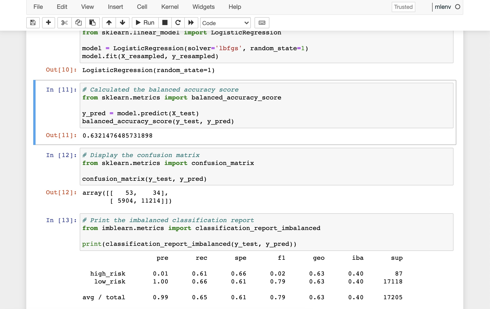
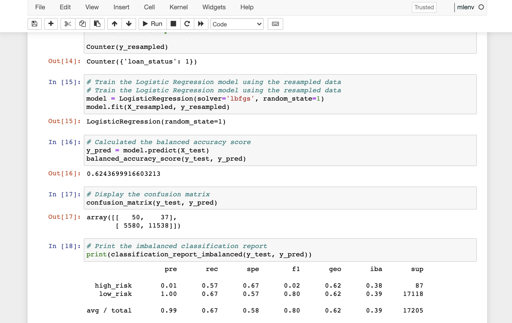
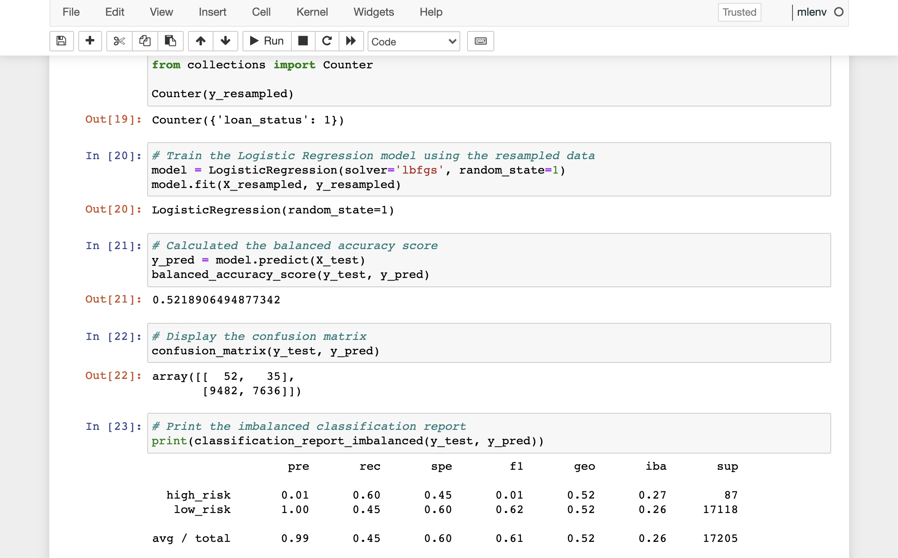
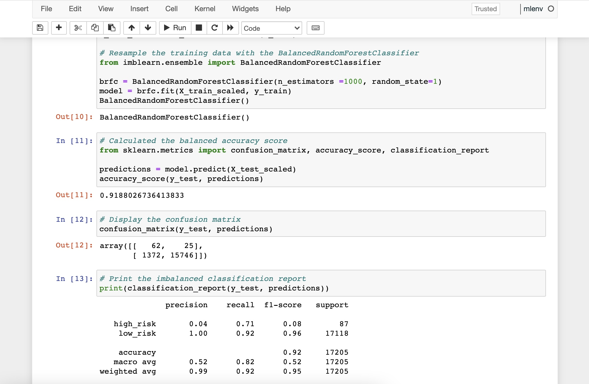
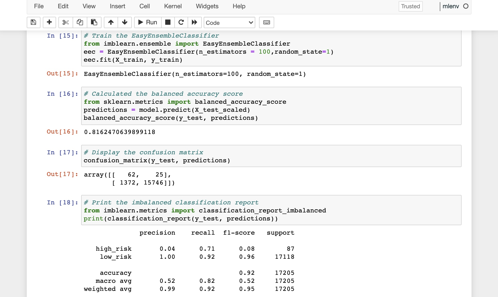

# Credit Risk Analysis

## Overview of the Analysis
The purpose of this project was to build and evaluate machine learning models by taking a look at all the factors in our loan_status.csv to predict whether someone is a low or high risk.

## Results
- Naive Random Oversampling Results: 
  - Balanced Accuracy Test score is 63%
  - Precision for the High Risk is low at only 1%
  - Recall is 61%

  
- SMOTE Oversampling Results: 
  - Balanced Accuracy Test score is 62%
  - Precision for the High Risk is low at only 1%
  - Recall is 57%

  
- Undersampling Results: 
  - Balanced Accuracy Test score is 52.2%
  - Precision is 99%
  - Recall is 45%

  
- Combination (Over and Under-Sampling) Results: 
  - Balanced Accuracy Test score is 60.86%
  - Precision is 99%
  - Recall is 55%
.jpg)

- Balanced Random Forest Classifier Results: 
  - Accuracy score is 91.88%
  - Precision is 99%
  - Recall is 92%

  
- Easy Ensemble AdaBoost Classifier Results: 
  - Accuracy score is 81.62%
  - Precision is 99%
  - Recall is 92%

  
## Summary
- In the first four models I undersampled, oversampled and did a combination of both to try to determine which model is the best at predicting which loans are the highest risk. 
- In the last two models I resampled the data using ensemble classifiers to predict which loans are high or low risk. 
- In the first four models the accuracy and recall scores are not as high as the ensemble classifiers.
- For the results, you'd want a good balance of recall and precision so I would recommend the Balanced Random Forest Classifier because of it's high accuracy score and good balance of precision and recall scores. 